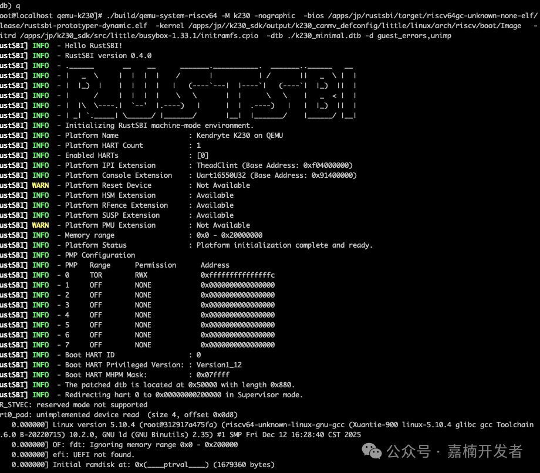

# k230_on_qemu

记录一下我在qemu平台上模拟 [K230 soc](https://www.kendryte.com/k230_canmv/zh/main/zh/index.html)，
并兼容使用 RustSbi 作为 Bios 启动的全流程。

最终成果：我们提交了相关patch并被上游所接受： https://lore.kernel.org/qemu-devel/cover.1768884546.git.chao.liu.zevorn@gmail.com/

我的工作记录：
- qemu: [link](https://github.com/fkcrazy001/qemu-k230)
- rustsbi: [link](https://github.com/fkcrazy001/rustsbi)



## 初始状态

k230 soc具有两个cpu，我们主要模拟小核的启动的过程。

它基于risc-v指令集架构，目前主要的指令集和寄存器的扩展都已经实现(对于一些非risc-v规范的寄存器，读是返回0，写会被忽略)。
当前可以启动 k230 sdk 的 uboot，更具体的，查看此[issuse](https://github.com/gevico/qemu/issues/1)。


既然能够启动官方的uboot，至少说明cpu的isa和寄存器实现没有太大问题。
uboot有相关输出，说明串口设备的实现也是没有问题的。


## rustsbi 分析

官方地址是：https://github.com/rustsbi/rustsbi

我对rust还算熟悉，但是对rustsbi了解不深。 因为之前Arceos项目有用到rustsbi，所以对它的功能还算清楚：
- 它是运行在M态的一个二进制，
- 用类似于系统调用的方式提供了一些调用给S态的内核。
- 此外，它还有分发中断这类的作用。

但是rustsbi项目是如何组织的，以及怎么编译的，这块我是不太了解。不如先提出需求，然后拿着问题去看这个项目吧。

```sh
qemu-system-riscv64 \
    -M k230 \
    -nographic \
    -device loader,file=k230_sdk/output/k230_canmv_defconfig/little/uboot/u-boot.bin,addr=0x8000000
```

### 需求分析

注意到启动命令固定的把uboot.bin放在了 0x8000000 的地方上。那么首先我们要把 rustsbi 也放在这个位置上看看。
这里就给出两个需求：
  - 把rustsbi编译为bin
  - rustsbi 的入口地址应该为 0x8000000

uboot能够输出，说明它肯定以某种方式获取了soc的串口地址。很显然，uboot可以认为是整个cpu上最先启动的程序，那么就没有别人和它说这个地址。
猜测它肯定是builtin了设备树，那么我们肯定也要把设备树增加到rustsbi中。
  - 给 rustsbi 增加设备树

### 需求实现
  
  通过阅读 rustsbi 文档，发现 [prototyper](https://github.com/rustsbi/rustsbi/blob/main/prototyper/README.md) 是我所需要的，
  因为我就需要一个firmware。文档里也给出了编译fdt的办法，通过传递 `--fdt $fdt_file ` 就可以。

  修改rustsbi地址的话文档里就没有了，但是简单的来讲，肯定要去找linker script。因为像这种没有os的程序，肯定是在这里定义了.text段的地址。

  在 `prototyper/prototyper/build.rs` 中 发现了链接脚本。

```rust
const LINKER_SCRIPT: &[u8] = b"OUTPUT_ARCH(riscv)
ENTRY(_start) 
SECTIONS {
    . = 0x80000000;

    . = ALIGN(0x1000); /* Need this to create proper sections */
    sbi_start = .;

    .text : ALIGN(0x1000) { 
        *(.text.entry)
        *(.text .text.*)
    }

    . = ALIGN(0x1000);
    sbi_rodata_start = .;

    .rodata : ALIGN(0x1000) { 
        *(.rodata .rodata.*)
        *(.srodata .srodata.*)
        . = ALIGN(0x1000);  
    } 

    .dynsym : ALIGN(8) {
        *(.dynsym)
    }

    .rela.dyn : ALIGN(8) {
        __rel_dyn_start = .;
        *(.rela*)
        __rel_dyn_end = .;
    }

    . = ALIGN(0x1000);
    sbi_rodata_end = .;

	/*
	 * PMP regions must be to be power-of-2. RX/RW will have separate
	 * regions, so ensure that the split is power-of-2.
	 */
	/* . = ALIGN(1 << LOG2CEIL((SIZEOF(.rodata) + SIZEOF(.text)
				+ SIZEOF(.dynsym) + SIZEOF(.rela.dyn)))); */

    .data : ALIGN(0x1000) { 
        sbi_data_start = .;
        *(.data .data.*)
        *(.sdata .sdata.*)
        . = ALIGN(0x1000); 
        sbi_data_end = .;
    }
    sidata = LOADADDR(.data);

    .bss (NOLOAD) : ALIGN(0x1000) {  
        *(.bss.stack)
        . = ALIGN(0x1000);
        sbi_heap_start = .;
        *(.bss.heap)
        sbi_heap_end = .;
        . = ALIGN(0x1000); 
        sbi_bss_start = .;
        *(.bss .bss.*)
        *(.sbss .sbss.*)
        sbi_bss_end = .;
    } 
    /DISCARD/ : {
        *(.eh_frame)
    }

    . = ALIGN(0x1000);

    .text : ALIGN(0x1000) {
        *(.fdt)
    }
    . = ALIGN(0x1000);
    sbi_end = .;

    .text 0x80200000 : ALIGN(0x1000) {
        *(.payload)
    }
}";

```

    不过一般来说，这种代码应该都是PIC的，也就是地址无关的。搜索 0x80000000 发现了 relocation_update 函数, 也确实发现了做了重定位。
    所以需求1和2可能不需要做？需求三的话就很简单了，只需要在编译 prototyper 的时候加上 -fdt 参数就可以。

```sh
# 尝试不实现需求1和2，能不能把rustsbi跑起来

# 这个dtb从官方的sdk中找出来
$ cargo prototyper --fdt ./k230_canmv.dtb
$ cd ${qemu_k230} && ./build/qemu-system-riscv64 -M k230 -nographic -device loader,file=${rustsbi}/target/riscv64gc-unknown-none-elf/release/rustsbi-prototyper-dynamic.bin,addr=0x8000000

[RustSBI] INFO  - Hello RustSBI!
[RustSBI] INFO  - RustSBI version 0.4.0
[RustSBI] INFO  - .______       __    __      _______.___________.  _______..______   __
[RustSBI] INFO  - |   _  \     |  |  |  |    /       |           | /       ||   _  \ |  |
[RustSBI] INFO  - |  |_)  |    |  |  |  |   |   (----`---|  |----`|   (----`|  |_)  ||  |
[RustSBI] INFO  - |      /     |  |  |  |    \   \       |  |      \   \    |   _  < |  |
[RustSBI] INFO  - |  |\  \----.|  `--'  |.----)   |      |  |  .----)   |   |  |_)  ||  |
[RustSBI] INFO  - | _| `._____| \______/ |_______/       |__|  |_______/    |______/ |__|
[RustSBI] INFO  - Initializing RustSBI machine-mode environment.
[RustSBI] INFO  - Platform Name                 : kendryte k230 canmv
[RustSBI] INFO  - Platform HART Count           : 1
[RustSBI] INFO  - Enabled HARTs                 : [0]
[RustSBI] WARN  - Platform IPI Device           : Not Available
[RustSBI] INFO  - Platform Console Extension    : Uart16550U32 (Base Address: 0x91400000)
[RustSBI] WARN  - Platform Reset Device         : Not Available
[RustSBI] WARN  - Platform HSM Extension        : Not Available
[RustSBI] WARN  - Platform RFence Extension     : Not Available
[RustSBI] WARN  - Platform SUSP Extension       : Not Available
[RustSBI] WARN  - Platform PMU Extension        : Not Available
[RustSBI] INFO  - Memory range                  : 0x0 - 0x20000000
[RustSBI] INFO  - Platform Status               : Platform initialization complete and ready.
[RustSBI] INFO  - PMP Configuration
[RustSBI] INFO  - PMP   Range      Permission      Address
[RustSBI] INFO  - 0     OFF        NONE            0x0000000000000000
[RustSBI] INFO  - 1     TOR        RWX             0x0000000000000000
[RustSBI] INFO  - 2     TOR        RWX             0x0000000008000000
[RustSBI] INFO  - 3     TOR        R               0x0000000008027000
[RustSBI] INFO  - 4     TOR        NONE            0x0000000008035000
[RustSBI] INFO  - 5     TOR        R               0x0000000008074000
[RustSBI] INFO  - 6     TOR        RWX             0x0000000020000000
[RustSBI] INFO  - 7     TOR        RWX             0xfffffffffffffffc
[RustSBI] INFO  - Boot HART ID                  : 0
[RustSBI] INFO  - Boot HART Privileged Version: : Version1_12
[RustSBI] INFO  - Boot HART MHPM Mask:          : 0x07ffff
[RustSBI] ERROR - No dynamic information available at address 0x0
QEMU: Terminated
```

可以！ 确实看到输出了，这样我们就不用改rustsbi的代码，继续尝试后面的部分了！

### 一个坑

实际实现的时候肯定比文档要麻烦的多，其中的坑更是数不胜数。

这里我记录了最不明显，也是最困扰的一个坑：栈溢出。
目前这个问题还没有fix，所以注意不要开启debug模式使用。
https://github.com/rustsbi/rustsbi/issues/172


## start 官方 kernel + initd

如何编译官方sdk以及busybox就不再这里写出来了。
前者在官网上都有的，而后者借助ai等工具也是很简单的事情。不过为了尽可能的使用k230的扩展，要使用官方的compiler。

通过 --kernel 传递进去之后发现现象还是和之前一样， `[RustSBI] ERROR - No dynamic information available at address 0x0`,
查看代码发现这个是去读取了 a2寄存器(soc板卡初始化代码传递的参数)，而我们的boot代码很简单，只是设置了陷阱然后跳转到 0x8000000 而已。
```c
    /* Mask ROM reset vector */
    uint32_t reset_vec[] = {
        /* 0x91200000: auipc  t0, 0x0              */ 0x00000297,
        /* 0x91200004: addi   t0, t0, 36 # <trap>  */ 0x02428293,
        /* 0x91200008: csrw   mtvec, t0            */ 0x30529073,
        /* 0x9120000C: csrr   a0, misa             */ 0x301012F3,
        /* 0x91200010: lui    t0, 0x1              */ 0x000012B7,
        /* 0x91200014: slli   t0, t0, 1            */ 0x00129293,
        /* 0x91200018: and    t0, a0, t0           */ 0x005572B3,
        /* 0x9120001C: bnez   t0, loop             */ 0x00511063,
        /* entry:                                  */
        /* 0x91200020: addiw  t0, zero, 1          */ 0x0010029b,
        /* 0x91200024: slli   t0, t0, 0x1b         */ 0x01b29293,
        /* 0x91200028: jr     t0 # uboot 0x8000000 */ 0x00028067,
        /* loop:                                   */
        /* 0x9120002C: j      0x9120002C # <loop>  */ 0x0000006f,
        /* trap:                                   */
        /* 0x91200030: j      0x91200030 # <trap>  */ 0x0000006f,
    };

```

在k230.c中可以看到内存布局

```c
static const MemMapEntry memmap[] = {
    [K230_DEV_DDRC] =         { 0x00000000, 0x80000000 },
    [K230_DEV_KPU_L2_CACHE] = { 0x80000000, 0x00200000 },
    ...
}
```

### 一些妥协
- 一些 page flags 的忽略
  
- 
